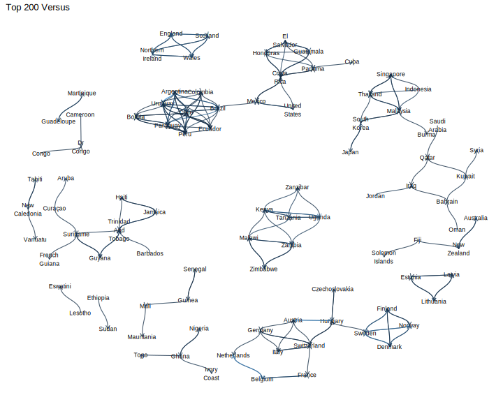

<style>                     
.navbar {
  background-color:green;
  border-color:green;
}
.navbar-brand {
color:yellow!important;
}

.nav-link{
color: Red!important;
}

.navbar-inverse .navbar-nav > .active > a,
.navbar-inverse .navbar-nav > .active > a:hover,
.navbar-inverse .navbar-nav > .active > a:focus {
  color: white;
  background-color: #cdcd00;
}

.navbar-inverse .navbar-toggle:hover,
.navbar-inverse .navbar-toggle:focus {
  background-color: #cdcd00;
}
.navbar-inverse .navbar-collapse,
.navbar-inverse .navbar-form {
  border-color: #cdcd00;
}


</style>

```{r setup, include=FALSE}
library(flexdashboard)
knitr::opts_chunk$set(echo = FALSE, warning=FALSE)
library(tidyverse)
library(dplyr)
library(tidyr)
library(plotly)
library(webshot)
library("imager")
```

About{data-orientation=columns}
=========================================

Column1 {data-width=750}
-----------------------------------------

### World Map
```{r}
# games = read.csv("./data/results.csv")
# games['date'] = apply(games["date"],1, as.character)
# 
# games['year'] = apply(games["date"],1, function(x) as.integer(substr(x,1,4)))
# games_1900 = games[games["year"]>=1900,]
# 
# home_team = table(games_1900["home_team"])
# away_team = table(games_1900["away_team"])
# 
# home = as.data.frame(home_team)
# away = as.data.frame(away_team)
# 
# country_games = merge(home,away,by="Var1")
# country_games$Var1 = as.character(country_games$Var1)
# country_games$Var1[country_games$Var1 == "China PR"]<-"China"
# country_games$Var1[country_games$Var1 == "North Korea"]<-"Korea, North"
# country_games$Var1[country_games$Var1 == "South Korea"]<-"Korea, South"
# country_games$Var1[country_games$Var1 == "England"]<-"United Kingdom"
# country_games["games"] = country_games["Freq.x"]+country_games["Freq.y"]
# 
# 
# df <- read.csv("https://raw.githubusercontent.com/plotly/datasets/master/2014_world_gdp_with_codes.csv")
# 
# df = merge(df,country_games,by.x="COUNTRY",by.y="Var1")
# 
# g <- list(
#   showframe = FALSE,
#   projection = list(type = 'Mercator')
# )
# 
# m <- list(
#   l = 0,
#   r = 0,
#   b = 100,
#   t = 0,
#   pad = 0
# )
# fig <- plot_ly(df, type='choropleth', 
#                locations=df$CODE, 
#                z=df$games, 
#                text=df$COUNTRY, 
#                colorscale="Greens",
#                reversescale =T,
#                width = 1200,
#                height = 900)
# 
# fig <- fig %>% layout(
#   title="Games Played by Country Since 1900",
#   geo = g
# ) %>% colorbar(title = "Games", thickness=10,y=0.7)
#fig
```
<iframe src="./img/games_map.html" title="World Map" width="100%" height="100%" frameBorder="0"></iframe>

Column {data-width=250}
-----------------------------------------
### About
In this Flexboard, Soccer's popularity changing and some other facts about soccer games will be explored through the total national soccer events since 1900 and lots of tweets from famous soccer clubs.

The world map on the left shows how many games a country played since 1900. South America and Europe are the most active places.

Data sources:

tweets: https://www.kaggle.com/eliasdabbas/european-football-soccer-clubs-tweets

Events: https://www.kaggle.com/martj42/international-football-results-from-1872-to-2017

Packages:
dplyr, 1.0.2/ 
tidyr, 1.1.2/ 
tidyverse, 1.3.0/ 
plotly, 4.9.2.1/ 
ggplot2, 3.3.2/ 
ggraph, 2.0.3/ 
igraph, 1.2.6/ 
tidygraph, 1.2.0/ 
stringr, 1.4.0/ 
tm, 0.7-8/ 
SnowballC, 0.7.0/ 
wordcloud, 2.6/ 
RColorBrewer, 1.1-2/ 
imager, 0.42.3


Events EDA{data-orientation=rows}
=========================================

Row1 {data-height=500}
-----------------------------------------
### Events Count
```{r}
# games = read.csv("./data/results.csv")
# games['date'] = apply(games["date"],1, as.character)
# 
# games['year'] = apply(games["date"],1, function(x) as.integer(substr(x,1,4)))
# games_1900 = games[games["year"]>=1900,]
# games_1900_2000 = games_1900[games_1900["year"]<=2020,]
# fig1 <- plot_ly(x = games_1900_2000$year, type = "scatter", mode="line",name="Total Games by Year")
# d1 <- games_1900_2000 %>% group_by(year) %>% summarise(n = n())
# fig_each_year <- plot_ly(x = d1$year, y = d1$n, type = "scatter", mode="line", name="Games Played this Year")
# fig_games <- subplot(fig1,fig_each_year,nrows = 2, shareX = TRUE)
# fig_games <- fig_games %>% layout(title = "Games Increase through Time")
# fig_games <- fig_games %>% layout(legend = list(x = 0.1, y = 0.9),
#                                   xaxis = list(title = 'Year'),
#                                   yaxis = list(title = 'Num of Games'))
# export(fig_games, file = "img/num_events.png")
# fig_games
```


### Tournaments
```{r}
# tours = games_1900_2000 %>% group_by(tournament) %>% summarise(cnt = n())
# tours = tours[order(-tours$cnt),]
# 
# t10 = head(tours,11)
# t10 = t10[-1,]
# t10$tournament <- lapply(t10$tournament, as.character)
# fig <- plot_ly(x=t10$cnt, y =t10$tournament, type = 'bar', orientation = 'h', color = I("Dark Green"))
# fig <- fig %>% layout(xaxis = list(title="Num of Games"))
#log = export(fig, file = "./img/tournaments.png")

```


Row2 {data-height=500}
-----------------------------------------
### Goals Stats
```{r}
# games_1900_2000$total_goal = games_1900_2000$home_score+games_1900_2000$away_score
# fig_home_away <- plot_ly(x=games_1900_2000$home_score, type = "violin", name="Home Goals", width = 1200, height = 300)
# fig_home_away<- fig_home_away %>% add_trace(x = games_1900_2000$away_score, name="Away Goals")
# fig_home_away<- fig_home_away %>% add_trace(x = games_1900_2000$total_goal, name="Total Goals")
#fig_home_away
```


Analysis {.storyboard}
=========================================


### Top 100 versus betwenn countries

```{r, fig.width=20, fig.height=20}
# library(tidyverse)
# library(dplyr)
# library(tidyr)
# library(plotly)
# library(tidygraph)
# library(igraph)
# library(ggplot2)
# 
# games = read.csv("./data/results.csv")
# games['date'] = apply(games["date"],1, as.character)
# 
# games['year'] = apply(games["date"],1, function(x) as.integer(substr(x,1,4)))
# games_1900 = games[games["year"]>=1900,]
# 
# games_1900$home_team = as.character(games_1900$home_team)
# games_1900$away_team = as.character(games_1900$away_team)
# 
# versus <- aggregate(games_1900, by=list(games_1900$home_team, games_1900$away_team), FUN=length);
# 
# versus = versus %>% select(Group.1, Group.2, date)
# top_versus = head(versus[order(-versus$date),],200)
# 
# graph_versus <- as_tbl_graph(top_versus)
# 
# library(stringr)
# graph_versus <- graph_versus %>%
#   activate(nodes) %>%
#   mutate(
#     title = str_to_title(name),
#     label = str_replace_all(title, " ", "\n")
#   )
# 
# thm <- theme_minimal() +
#   theme(
#     legend.position = "none",
#     axis.title = element_blank(),
#     axis.text = element_blank(),
#     panel.grid = element_blank(),
#     panel.grid.major = element_blank(),
#   )
# 
# theme_set(thm)
# 
# library(ggraph)
# fig <- graph_versus %>%
#   ggraph(layout = 'kk') +
#   geom_node_text(aes(label = label), size = 3) +
#   geom_edge_diagonal(aes(color = date), alpha = 0.8, arrow = arrow(length = unit(2, 'mm')))
# fig
# ggsave(file="./img/network.svg", plot=fig, width=10, height=8)
```


***

- Basically Countries tend to have more games with close countries.


- South America countries play lots of games versus each other.


- Europe is a little suprising. The Northern Europe play most.


- British should Brexit :) They play with themselves most.


- Soccer is another form of competition for countries in same areas.


### WordCloud of English Tweets

```{r}
library("tm")
library("SnowballC")
library("wordcloud")
library("RColorBrewer")
library("imager")

# tweets = read.csv("./data/clubs_tweets.csv")
# 
# tweets.en = tweets[tweets$tweet_lang == "en",]
# 
# 
# tweets.en["tweet_full_text"] = apply(tweets.en["tweet_full_text"],1, function(x) gsub("?(f|ht)(tp)(s?)(://)(.*)[.|/](.*)", "", x))
# tweets.en["tweet_full_text"] = apply(tweets.en["tweet_full_text"],1, function(x) gsub("[^\x01-\x7F]", "", x))
# 
# tweets.en.text = tweets.en$tweet_full_text
# 
# 
# docs <- Corpus(VectorSource(tweets.en.text))
# toSpace <- content_transformer(function (x , pattern ) gsub(pattern, " ", x))
# docs <- tm_map(docs, toSpace, "/")
# docs <- tm_map(docs, toSpace, "@")
# docs <- tm_map(docs, toSpace, "\\|")
# docs <- tm_map(docs, content_transformer(tolower))
# 
# docs <- tm_map(docs, removeNumbers)
# 
# docs <- tm_map(docs, removeWords, stopwords("english"))
# 
# docs <- tm_map(docs, removeWords, c("blabla1", "blabla2"))
# docs <- tm_map(docs, removePunctuation)
# 
# docs <- tm_map(docs, stripWhitespace)
# 
# dtm <- TermDocumentMatrix(docs)
# m <- as.matrix(dtm)
# v <- sort(rowSums(m),decreasing=TRUE)
# d <- data.frame(word = names(v),freq=v)
# 
# 
# wordcloud(words = d$word, freq = d$freq, min.freq = 1,
#            max.words=300, random.order=FALSE, rot.per=0.35,
#            colors=brewer.pal(10, "Dark2"))

# fpath <- system.file("img/wordCloud.png") 
# im <- load.image("img/wordCloud.png")
# dev.new(width = 550, height = 330, unit = "px")
# plot(im, axes = FALSE)

```


*** 
- The large clubs tend to have more tweets. 

- Real Madrid is the most popular club in the world. The most popular tweets on soccer clubs are Hala Madrid and Real Madriden. 

- Juventus and Bayern and Ajax do also tweet a lot. 

- Laliga, the Spain league seems more popular on tweet. 

- The England clubs suprisingly have no clue in word cloud even though it is based on English tweets. They should definitely play with themselves:)


